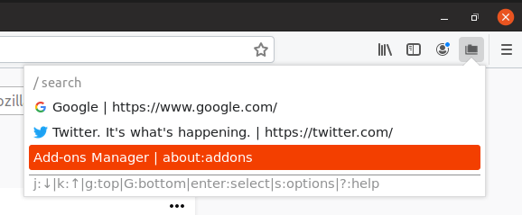
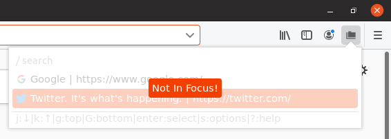
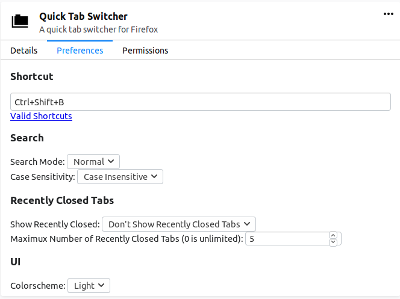
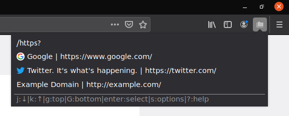
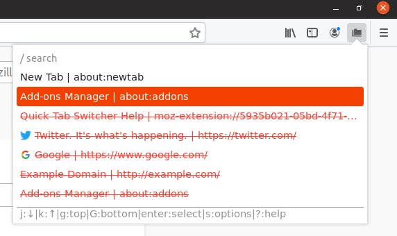
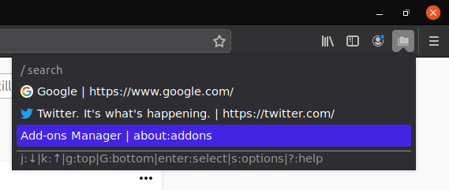

# Quick Tab Switcher Help

This is the main display for Quick Tab Switcher:

It displays the tabs that are open in the current window, with their favicons, page title, and URL.

You can navigate with keyboard shortcuts (shown at the bottom of the popup)

 * Pressing J or &darr; will select the next (below) tab, and pressing K or &uarr; will select the previous (above) tab.
   * These will wrap around. (Pressing &darr; on the last tab will wrap arount to the first tab, etc.)
 * Pressing g will select the top tab, and G will select the bottom tab.
 * Pressing Enter will switch to the selected tab and close the popup.
 * Pressing s will open the [settings](#settings) for the extension.
 * Pressing ? will open this page.
 * Pressing / will focus the [search box](#search).

When the popup is out of focus, you can't use keyboard shortcuts. An error will show alerting you that the popup is out of focus:

When this happens, close and reopen the popup, or click inside the popup to focus it.

# Settings

The settings page looks like this:

## Shortcut
The shortcut option decides which keyboard shortcut opens the popup. It defaults to Ctrl+Shift+B.  
You can see what makes up a valid shortcut on [MDN](https://developer.mozilla.org/en-US/docs/Mozilla/Add-ons/WebExtensions/manifest.json/commands#Key_combinations)

## Search
The search options affect how the search box in the popup works. The search is run on the page title and URL for each tab.  
Press Enter after you enter your search term to put the cursor back on the tab list.

If search mode is normal (default), it will show only the items that contain the search term. If search mode is regex, you can use [regular expressions](https://en.wikipedia.org/wiki/Regular_expression) in your search terms.

Here is an example of the search (regex mode) showing only tabs with http or https in the title or URL:

The case sensitivity option allows you to ignore or enforce CaPItAl leTteRs. (Default Insensitive)

## Recently Closed Tabs
If you enable recently closed tabs, you can see tabs that you recently closed. They will be shown with red text and strikethrough to show that they were closed. Selecting one of these will open the tab again.

You can select how many recently closed tabs to show in the list at a time (Default 5). 0 is unlimited recently closed tabs.

## UI
You can select the theme of the extension. The light theme was shown above, here is an example of the dark theme:

